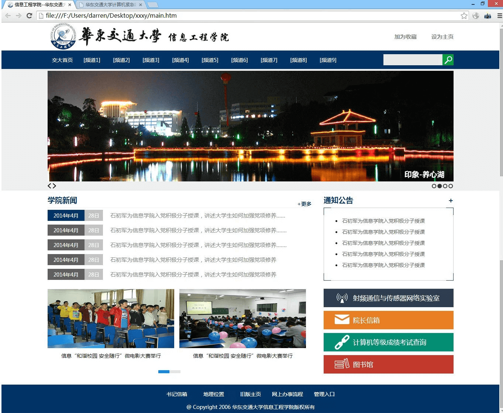

## 关于xxxy
WebPlus是许多高校均使用的网站群搭建平台。xxxy是一套基于webplus定制的一套UI模板，该模板清新、风格自然大方。

## 使用xxxy
* 更换logo：images下有一个叫headbg.png的文件，直接替换就行
* 更换轮播图片：直接替换images中的图片文件，或者在main.htm中更新路径
* 更换链接和频道绑定：main.htm、listcolumn.htm、displayinfo.htm是三个模板
* 详情页的和列表页的页头背景图片在index.js中有个数组定义

## 实际展示效果图

## 如何制作模板
[参考教程](http://rightblog.iyuxy.top/?p=135)
